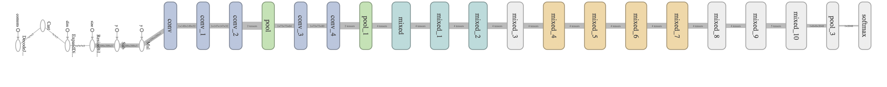
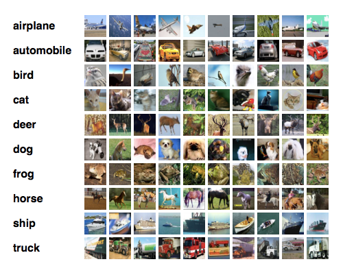

# CSE586/EE554 Computer Vision II - Spring 17 (Project 2)

## Abstract

Transfer learning is a method to use fully-trained model for a set of categories and use them for other dataset and classes. This could be done by extracting the next-to-the final layer features and use them to train a classifier such as Support Vector Machine (SVM). Another method is by retraining just the final layer(s) of existing pre-trained models for the new data set, and keeping the rest of the network frozen. Both of these are used in this project and resulted in high accuracy around 88%.

## Framework, Pre-trained CNN, and Test Data Set
### Software

 As for the framework for implementing the CNN, the TensorFlow, a Google's deep learning software is used. TensorFlow supports both C++ and Python. We have used Python for implementing this project, also we have used "SKLearn" for the Linear SVM to classify the images for the first part.

### Pre-trained CNN

For the Pre-trained CNN the Google’s deep learning model, called [Inception-v3](http://arxiv.org/abs/1512.00567), is used, which has been trained for [ImageNet Competition](http://www.image-net.org/challenges/LSVRC/) on LSVRC 2012, and a network configuration and pre-trained data are available for using in TensorFlow. This model has shown a very high vision performance, due to a special design of inception architecture.

The following figure illustrated the overview of Inception-v3 network. As we can see at the very start of the network there are some extra layer for resizing and reshaping the input images. Using those layer, we can easily feed any image without specific constraint to Inception-v3.

### Test Date Set

The [CIFAR-10](https://www.cs.toronto.edu/~kriz/cifar.html) dataset is used for our supervised learning. It consists of 10 classes, each of which has 6000 images. The 50000 out of the total 60000 images are the train images, and the rest are the test ones.

## Transfer Learning and Fine Tuning of CNN

The next-to-last layer of the Inception-v3 is used as the feature vectors, which in TensorFlow is called the “pool_3” layer.

We have used two different approaches for transfer learning of these features:

* The First approach is by means of linear SVM to train the labeled features for the CIFAR-10 training set, and test the performance through its test set.

* The second approach is retraining the last two layers of fully-connected and softmax through backpropagation and keep the rest of the network untouched/frozen. It runs 4000 test, each of which chooses 10 random images in the training batch and find the weight values through backpropagation. This gives the “training accuracy”. It also tests the accuracy on the images not included in training step, which is called the “validation accuracy”. This gives a better perception of the accuracy measurement of the system. The cross-entropy is the loss function which is needed to be optimized during the training phase. Finally, it evaluates the performance for the test batch which gives the “test accuracy”, and is the best estimate of the performance.

## Results
In the following sub-sections you will find the example of usage and results of our two different experiments.
* [CIFAR-10 and Inception](https://github.com/MortezaRamezani/s17-cse586-p2/blob/master/cifar-inception.ipynb)
* [SVM classifier](https://github.com/MortezaRamezani/s17-cse586-p2/blob/master/svm.ipynb)
* [Retrain classifier](https://github.com/MortezaRamezani/s17-cse586-p2/blob/master/retrain.ipynb)

## Conclusion
In this project we have tried two different transfer learning methods. In both case we have extracted the features from next to the final layers and used them to feed through either a linear SVM or another network on top of original network. Our results showed that even using the pre-trained network (for ImageNet) can produce an acceptable accuracy for another set of images.

## References
1. [https://www.tensorflow.org/](https://www.tensorflow.org/)
2. [http://www.image-net.org/challenges/LSVRC/](http://www.image-net.org/challenges/LSVRC/)
3. Christian Szegedy, Vincent Vanhoucke, Sergey Ioffe, Jonathon Shlens, Zbigniew Wojna “[Rethinking the Inception Architecture for Computer Vision](http://arxiv.org/abs/1512.00567)” arXiv:1512.00567v
4. [http://www.cs.toronto.edu/~kriz/cifar.html](http://www.cs.toronto.edu/~kriz/cifar.html)
